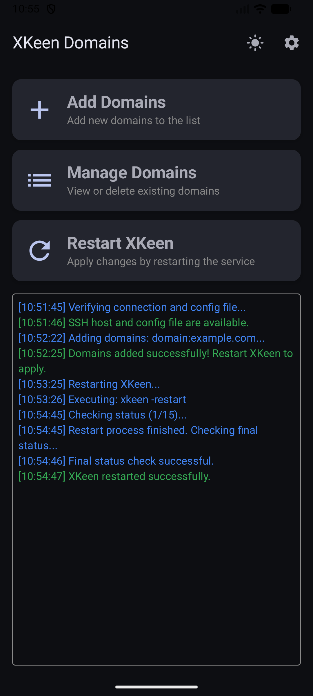
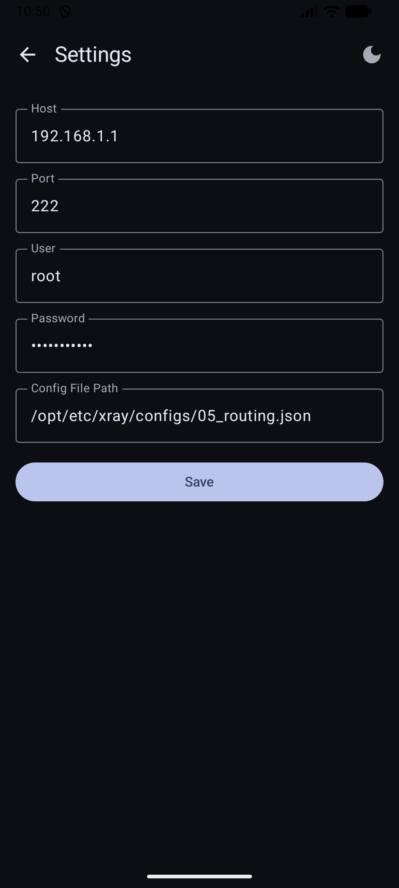
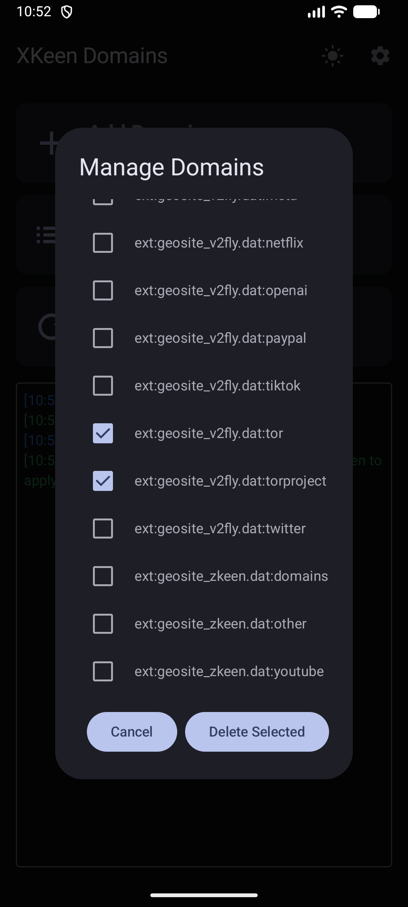

# XKeen Domains - Android Client

XKeen Domains is a dedicated Android application designed to simplify the management of domain lists within a remote Xray client configuration for Keenetic routers. It provides a user-friendly mobile interface to perform SSH operations, eliminating the need for manual terminal access for common tasks.

---

**Краткое описание (RU):**

XKeen Domains — это Android-приложение, созданное для упрощения управления списками доменов в конфигурации клиента Xray для роутеров Keenetic. Оно предоставляет удобный мобильный интерфейс для выполнения SSH-операций, избавляя от необходимости вручную использовать терминал для выполнения рутинных задач.

---

## Screenshots

<p align="center">
  
  &nbsp; &nbsp; &nbsp;
  
</p>
<p align="center">
  <em>Main screen with Material 3 tiles and the flexible Settings screen.</em>
</p>
<br>
<p align="center">
  
</p>


## Features

- **Connection Management:** Configure and save all necessary SSH connection details, including host, port, user, password, and the remote path to your configuration file.
- **Domain Management:**
    - **Add:** Easily add one or more comma-separated domains to your remote list.
    - **View & Delete:** Fetch and display the current list of domains, and remove selected entries.
- **Service Control:** Restart the `xkeen` service remotely with a single tap to apply changes.
- **Real-time Logging:** A color-coded log console on the main screen provides detailed feedback for all operations:
    - <span style="color:blue;">**Informational:**</span> Steps being taken.
    - <span style="color:green;">**Success:**</span> Confirmation of successful operations.
    - <span style="color:red;">**Errors:**</span> Clear and descriptive error messages for failed operations.
- **Connection Verification:** The app automatically checks for SSH host availability and configuration file existence upon launch and after settings changes.
- **Modern UI:**
    - Built with Jetpack Compose using a Material 3 tile-based design.
    - Supports persistent Light and Dark themes.
    - Custom app icon and splash screen for a polished user experience.

## Technical Overview

The application is built using modern Android development practices.

- **Language:** **Kotlin** (100%)
- **UI Framework:** **Jetpack Compose**
- **Architecture:**
    - **UI Layer:** `MainActivity.kt` contains all Composable screens and navigation logic.
    - **Navigation:** `androidx.navigation:navigation-compose` for switching between the main and settings screens.
    - **Data Persistence:** `SharedPreferences` (managed by `SettingsManager.kt`) for storing connection and theme settings.
    - **Business Logic:** `SshManager.kt` encapsulates all SSH communication and remote command execution.
- **Core Libraries:**
    - **JSch:** For handling the SSH connection and command execution.
    - **Gson:** For parsing and modifying the remote JSON configuration file.
    - **Core Splashscreen:** For a seamless and branded launch experience.

## How to Use

1.  **Clone the Repository:**
    ```bash
    git clone <your-repository-url>
    ```
2.  **Open in Android Studio:** Open the cloned project in the latest version of Android Studio.
3.  **Build the App:** The project should build successfully as all dependencies are defined in the Gradle scripts.
4.  **Configure Settings:**
    - Launch the app.
    - Tap the **Settings** icon in the top-right corner.
    - Fill in all the fields with your remote server's details:
        - **Host:** Your server's IP address or domain name.
        - **Port:** Your server's SSH port.
        - **User:** The username for the SSH connection.
        - **Password:** The password for the SSH user.
        - **Config File Path:** The absolute path to the `05_routing.json` file on the server.
    - Tap **Save**.
5.  **Use the App:** After saving, you will be returned to the main screen. The app will automatically test the connection. You can now use the tiles to manage your domains and restart the service.

## Project Structure

-   `.../MainActivity.kt`: Contains all UI components, including the main screen, settings screen, and various dialogs. Manages the navigation graph.
-   `.../SshManager.kt`: The core of the application. Handles all SSH-related tasks, including connecting, executing commands (`ps`, `cat`, `echo`, `xkeen`), and parsing results.
-   `.../SettingsManager.kt`: A helper class for saving and loading user settings (SSH credentials, theme) from `SharedPreferences`.
-   `.../ui/theme/`: Standard Jetpack Compose theme files (`Color.kt`, `Theme.kt`, `Typography.kt`).
-   `.../res/drawable/`: Contains the application icon (`icon.png`) and splash screen image (`splash.png`).
-   `.../res/values/themes.xml`: Defines the application theme and the custom splash screen theme.
-   `.../build.gradle.kts`: App-level Gradle script, containing all dependencies.
